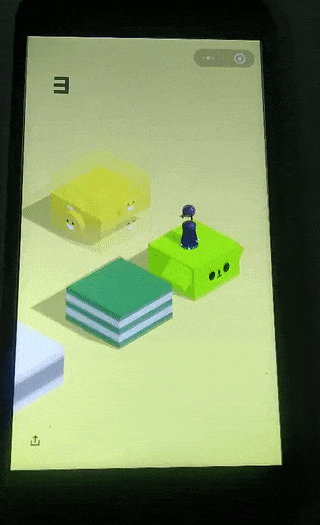

# 纯JavaScript Canvas 微信跳一跳 自动跳 刷分



## 声明
1. 本项目是在三水清大大的项目[https://github.com/ksky521/wechat-jump-game-hack](https://github.com/ksky521/wechat-jump-game-hack)基础下进行修改的，请给原创一个大大的Star。
2. 其次，三水清还写了一篇关于该项目通俗易懂深入浅出的教程，欢迎阅读品尝[JS写小游戏「跳一跳」外挂之Canvas图像识别](http://mp.weixin.qq.com/s?__biz=MzI3NTMxMTQ1Mw==&mid=2247483927&idx=1&sn=98ff765cd2fb48bdf5c15f15f66109fc&chksm=eb07fc25dc707533fa33cd140c346075a262a0db1ae455d01bd6d2a9a2d8354fb29a1574708e&mpshare=1&scene=1&srcid=0107sCTDm6ovOy04Vyi9XHDA#rd)

## 使用
```bash
npm i
npm start
// open localhost:9000/test 查看识别效果
```
1. 安装最新的 node.js 8 以上的版本，下载地址：[https://nodejs.org/](https://nodejs.org/)
2. 安装adb驱动（用于拉取手机截图下载地址：[https://adb.clockworkmod.com](https://adb.clockworkmod.com)）到D:\adb\
3. 把utils.js中ADB_PATH 设置为你电脑上adb路径，D:\adb\adb或者安卓SDK下的XXXXXX\Android\sdk\platform-tools\adb
4. 安卓手机打开开发者选项usb调试，小米要允许模拟点击事件
5. 数据线连上电脑，选择USB计算机连接方式为媒体设备(MTP)（确保手机能被电脑识别，并且关闭360或者应用宝手机助手等电脑程序），打开微信「跳一跳」点击开始
6. 在CMD等bash命令窗口下运行 npm i && npm start 启动程序（该窗口可以看错误日志）
7. Chrome浏览器打开 localhost:9000，按F12打开devtools查看跳一跳日志

## 原理
**只支持安卓**

1. 首先通过adb截图拉取到本地
2. 对本地图片通过Canvas获取当前和跳转位置
3. 通过计算两点距离，根据720等比例缩放，然后乘以系数2.04即为时间
4. 通过adb发送长按事件，事件为第三步计算的时间